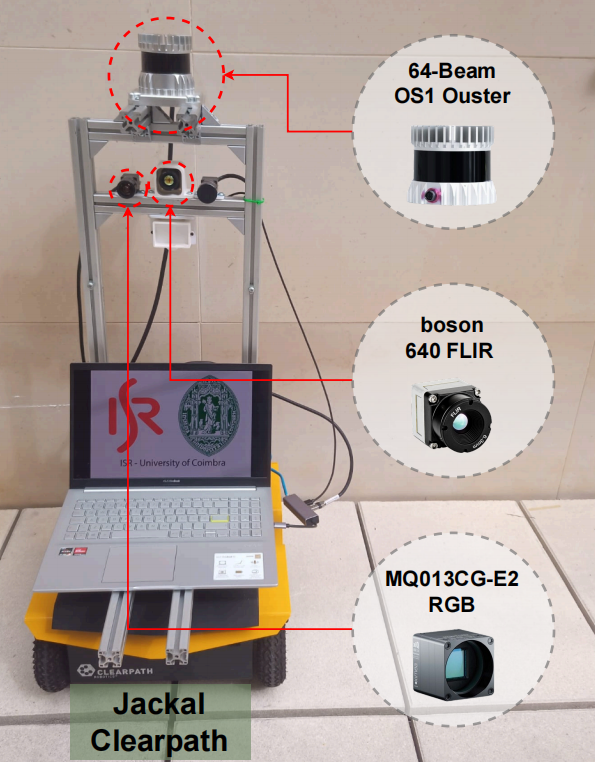
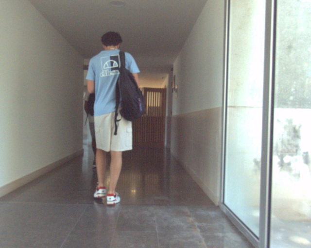
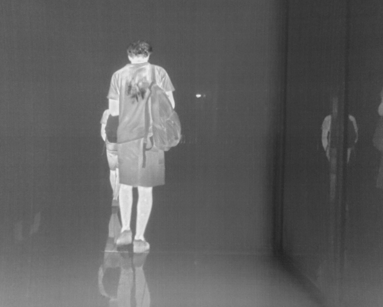

# Multimodal ISR Dataset [MID-1K]

[https://github.com/kennedyk1/MID-1K](https://github.com/kennedyk1/MID-1K)

FOR RAC/RML2024 - https://colab.research.google.com/drive/18IM7bnIlEMhe6KyG6spiV5aXzF8eNMkX?usp=sharing

This dataset, collected by the [ISR (Institute of Systems and Robotics)](https://www.isr.uc.pt/) Team, is a new multi-sensory dataset that was organized, calibrated, curated, and annotated. The sensory data was collected using ROS and a Jackal Clearpath mobile robot (see Fig. 1), operating in two indoor environments: three floors of the DEEC building and two floors of DEI building at the [University of Coimbra](https://www.uc.pt/), Polo 2, Portugal.

<table>
<tr>
<td align="center">

</td>
</tr>
<tr><td><em>Fig. 1: Sensors on mobile robot, Clearpath Jackal model: (RGB) Ximea MQ013CG-E2, (Thermal) Flir Boson 640x512 pixels, Lens 50º 8.7mm, 60 fps, and (LiDAR) Ouster OS1-64.</em></td></tr>
</table>

The dataset consists of 1100 selected frames, containing RGB, thermal and depth-map images  (generated from LiDAR) totaling 3300 image files (see Fig. 2). The sensors have been calibrated, but a small temporal misalignment is present due to hardware limitations.

<table>
    <tr>
        <td></td>
        <td></td>
        <td></td>
    </tr>
    <tr>
        <td colspan="3" align="center"><em>Fig. 2: Dataset frame-examples composed of Depth-LiDAR, RGB and Thermal modalities.</em></td>
    </tr>
</table>

The dataset was split into training and test sets. The training set contains 703 images and 2191 annotations, while the test set contains 397 images and 1629 annotations. The depth image representation was generated from the `projected` LiDAR point clouds using a modified bilateral filter. In particular, each LiDAR point cloud is projected on the RGB image-plane, considering the Camera-LiDAR calibration matrix, and then a sliding-window based weighing function, dependent on the range dispersion, is used to interpolate the points inside the mask therefore generating a dense representation.

<table>
    <tr><td colspan="2" align="center"><b>Dataset Details</b></td></tr>
    <tr><td>Total Files</td><td><em>6,600 files</em></td></tr>
    <tr><td>Total Images</td><td><em>3,300 images</em></td></tr>
    <tr><td>Total Annotations</td><td><em>3,300 txt files</em></td></tr>
    <tr><td>Dataset Size</td><td><em>Approximately 750 MB</em></td></tr>
    <tr><td>Images Resolution</td><td><em>640x512 pixels</em></td></tr>
    <tr><td>Annotation Format</td><td><em>YOLO</em></td></tr>
    <tr><td><b>Data Distribution</b></td><td><b>#Images</b></td></tr>
    <tr><td>Depth Images</td><td><em>1,100</em></td></tr>
    <tr><td>RGB Images</td><td><em>1,100</em></td></tr>
    <tr><td>Thermal Images</td><td><em>1,100</em></td></tr>
</table>
