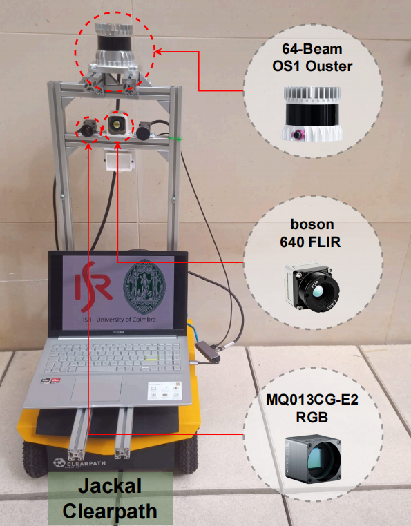

# Multimodal ISR Dataset [MID-1K]

[https://github.com/kennedyk1/MID-1K](https://github.com/kennedyk1/MID-1K)

For RAC/RML2024 Course - [Google Notebook](https://colab.research.google.com/drive/18IM7bnIlEMhe6KyG6spiV5aXzF8eNMkX?usp=sharing)

This dataset, collected by the [ISR (Institute of Systems and Robotics)](https://www.isr.uc.pt/) Team, is a new multi-sensory dataset that was organized, calibrated, curated, and annotated. The sensory data was collected using ROS and a Jackal Clearpath mobile robot (see Fig. 1), operating in two indoor environments: three floors of the [DEEC](https://www.uc.pt/fctuc/deec/) building and two floors of [DEI](https://www.uc.pt/fctuc/dei/) building at the [University of Coimbra](https://www.uc.pt/), Polo 2, Portugal.

You can clone this dataset to your local environment using the `git clone` command. Simply open the terminal and follow these steps:

   ```bash
   git clone https://github.com/kennedyk1/MID-1K
   ```

<table>
<tr>
<td align="center">

</td>
</tr>
<tr><td><em>Fig. 1: Sensors on mobile robot, Clearpath Jackal model: (RGB) Ximea MQ013CG-E2, (Thermal) Flir Boson 640x512 pixels, Lens 50º 8.7mm, 60 fps, and (LiDAR) Ouster OS1-64.</em></td></tr>
</table>

The dataset consists of 1100 selected frames, containing RGB, thermal and depth-map images  (generated from LiDAR) totaling 3300 image files (see Fig. 2). The sensors have been calibrated, but a small temporal misalignment is present due to hardware limitations.

<table>
    <tr>
        <td></td>
        <td></td>
        <td></td>
    </tr>
    <tr>
        <td colspan="3" align="center"><em>Fig. 2: Dataset frame-examples composed of Depth-LiDAR, RGB and Thermal modalities.</em></td>
    </tr>
</table>

The dataset was split into training and test sets. The training set contains 703 images and 2191 annotations, while the test set contains 397 images and 1629 annotations. The depth image representation was generated from the `projected` LiDAR point clouds using a modified bilateral filter. In particular, each LiDAR point cloud is projected on the RGB image-plane, considering the Camera-LiDAR calibration matrix, and then a sliding-window based weighing function, dependent on the range dispersion, is used to interpolate the points inside the mask therefore generating a dense representation.

<table>
    <tr><td colspan="2" align="center"><b>Dataset Details</b></td></tr>
    <tr><td>Total Files</td><td><em>6,600 files</em></td></tr>
    <tr><td>Total Images</td><td><em>3,300 images</em></td></tr>
    <tr><td>Total Annotations</td><td><em>3,300 txt files</em></td></tr>
    <tr><td>Dataset Size</td><td><em>Approximately 750 MB</em></td></tr>
    <tr><td>Images Resolution</td><td><em>640x512 pixels</em></td></tr>
    <tr><td>Annotation Format</td><td><em>YOLO</em></td></tr>
    <tr><td><b>Data Distribution</b></td><td><b>#Images</b></td></tr>
    <tr><td>Depth Images</td><td><em>1,100</em></td></tr>
    <tr><td>RGB Images</td><td><em>1,100</em></td></tr>
    <tr><td>Thermal Images</td><td><em>1,100</em></td></tr>
</table>

<table>
  <tr>
    <th></th>
    <th>RGB</th>
    <th>Thermal</th>
    <th>Depth</th>
  </tr>
  <tr>
    <td>Model</td>
    <td align="center"><em>Ximea MQ013CG-E2</em></td>
    <td align="center"><em>FLIR BOSON 640 LWIR</em></td>
    <td align="center"><em>OUSTER OS1-64-U</em></td>
  </tr>
  <tr>
    <td>Type</td>
    <td align="center"><em>Colour Camera</em></td>
    <td align="center"><em>Thermal Camera</em></td>
    <td align="center"><em>LiDAR</em></td>
  </tr>
  <tr>
    <td>Spec.</td>
    <td align="center"><em>1280x1024 pixels, 1.3 MP</em></td>
    <td align="center"><em>640x512 pixels</em></td>
    <td align="center"><em>Vert. Res.: 64 channels<BR>Hor. Res.: 1024 points</em></td>
  </tr>
  <tr>
    <td>Image Type</td>
    <td align="center"><em>.png</em></td>
    <td align="center"><em>.png</em></td>
    <td align="center"><em>.png</em></td>
  </tr>
  <tr>
    <td>Total Images</td>
    <td align="center"><em>1,100</em></td>
    <td align="center"><em>1,100</em></td>
    <td align="center"><em>1,100</em></td>
  </tr>
  <tr>
    <td>Total Files Annotations</td>
    <td align="center"><em>1,100 txt files</em></td>
    <td align="center"><em>1,100 txt files</em></td>
    <td align="center"><em>1,100 txt files</em></td>
  </tr>
  <tr>
    <td>Total Annotations (people)</td>
    <td align="center"><em>3,820</em></td>
    <td align="center"><em>3,797</em></td>
    <td align="center"><em>3,820¹</em></td>
  </tr>
  <tr>
    <td>Images Resolution</td>
    <td align="center"><em>640x512</em></td>
    <td align="center"><em>640x512</em></td>
    <td align="center"><em>640x512</em></td>
  </tr>
  <tr>
    <td>Annotation Format</td>
    <td align="center"><em>YOLO xywhn²</em></td>
    <td align="center"><em>YOLO xywhn²</em></td>
    <td align="center"><em>YOLO xywhn²</em></td>
  </tr>
  <tr>
    <td colspan="4" align="center"><em>¹ The labels from the RGB modality were used because the LiDAR was calibrated with the RGB camera.<BR>² YOLO normalized xywh format <b>class x_center y_center width height</b></em></td>
  </tr>
</table>

## Visit our datasets through the links below.
- MID-1K - [Multimodal ISR Dataset with 1100 images](https://kennedyk1.github.io/MID-1K/) (*RGB, thermal and depth*)
- MID-3K - [Multimodal ISR Dataset with 3000 images](https://kennedyk1.github.io/MID-3K/) (*RGB, thermal, depth and intensity*)


## References

- Sousa, E., Mota, K. O., Gomes, I. P., Garrote, L., Wolf, D. F., & Premebida, C. (2023, September). **Late-Fusion Multimodal Human Detection Based on RGB and Thermal Images for Robotic Perception**. In *2023 European Conference on Mobile Robots (ECMR)* (pp. 1-6).
